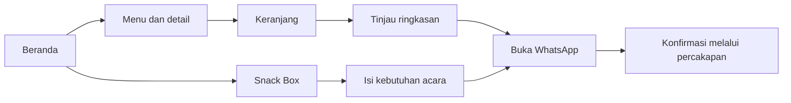

# PRD — Redesign Website Mamitika

**Versi:** 1.1 — disetujui pengguna sebagai dasar; keputusan teknis dan desain diperinci dalam dokumen pendamping  
**Tanggal:** 7 Oktober 2026  
**Bahasa utama:** Bahasa Indonesia  
**Produk:** website bakery Mamitika, katalog dengan keranjang menuju WhatsApp dan pengelolaan melalui admin.

## 1. Tujuan dan keputusan pengguna

Membuat website yang membantu pelanggan mengenal produk, memahami harga dan isi kemasan, menyusun pilihan belanja, serta memulai pemesanan melalui WhatsApp. Pelanggan snack box untuk acara mendapat jalur konsultasi tersendiri. Tampilan harus terasa seperti bakery rumahan Mamitika: hangat, berkarakter, mengutamakan foto asli, mudah digunakan, dan responsif.

Keputusan berikut berasal dari jawaban pengguna dalam penyusunan PRD:

| Topik | Keputusan |
| --- | --- |
| Pemesanan produk | Pilih beberapa produk dan jumlahnya dalam keranjang, kemudian kirim ringkasan ke WhatsApp. |
| Pelanggan utama | Pembeli produk satuan dan pemesan snack box sama penting. |
| Arah visual | Bakery rumahan yang hangat: krem, kuning mentega dari identitas logo, cokelat gelap, tipografi editorial, foto produk dominan. |
| Pengelolaan | Pemilik mengubah produk, harga, foto, dan ketersediaan sendiri melalui admin sederhana pada versi pertama. |
| Operasional | Tersedia ready stock dan pre-order; pengambilan sendiri dan pengiriman, dengan pengiriman lebih sering digunakan. Usaha berada di Bandung. |
| Jam layanan | 06.30–17.00 WIB. Hari layanan belum disebutkan. |
| Kanal tambahan | Pengguna menyatakan Mamitika tersedia di GoFood dan ShopeeFood; tautan toko belum diberikan. |

Spesifikasi visual, rincian interaksi, dan target kualitas di bawah merupakan usulan untuk menerjemahkan keputusan tersebut menjadi kebutuhan yang dapat dikembangkan dan diperiksa.

## 2. Data yang tersedia dan batasnya

Materi sumber berada di `mamitika-redesign-reference/` dan diperoleh pada 7 Oktober 2026.

| Bukti | Isi yang dapat dipakai |
| --- | --- |
| `README.md`, bagian Sumber dan Isi situs | Brand bakery homemade di Bandung; Home dan Gallery; WhatsApp, Instagram, dan lokasi. |
| `catalog.csv` | 18 entri produk, deskripsi, harga dalam rupiah, dan jumlah isi jika tercantum. |
| `asset-manifest.csv` dan `images/` | 38 berkas gambar dari Home dan Gallery; 36 isi berkas unik berdasarkan pemeriksaan hash. Sebagian berkas merupakan duplikat. |
| [Beranda sumber](https://www.mamitika.com/home) | Katalog dan tombol pemesanan. |
| [Galeri sumber](https://www.mamitika.com/gallery) | Foto snack box dan foto produk lain. |

Data kontak sumber:

- WhatsApp: `+62 831 9766 5812`, tujuan publik `https://wa.me/6283197665812`.
- Instagram: `@kuenyamamitika`.
- Lokasi: The Royal Stavana E9, Derwati, Bandung.

**Batas konten:** foto Roti Blueberry, Bolu Pisang Lumer, dan Lemper ada di galeri, tetapi harga dan status produknya tidak ada dalam katalog yang dikumpulkan. Foto tersebut boleh menjadi dokumentasi galeri; produk baru hanya dibuat setelah pemilik melengkapi datanya. Foto beranda yang tidak memiliki teks alternatif harus dipetakan ke produk yang benar sebelum digunakan. Jangan menebak berdasarkan nama berkas `image.jpg`.

Pengguna melengkapi fakta operasional pada bagian 1. Informasi tersebut adalah klarifikasi pengguna, bukan hasil ekstraksi situs. Cakupan pengiriman, ongkos kirim, hari layanan, minimum snack box, tenggat pre-order, tautan toko GoFood/ShopeeFood, alergen, masa simpan, sertifikasi, dan kebijakan pembatalan masih perlu dikonfirmasi. Isian yang belum terkonfirmasi tidak boleh berubah menjadi klaim publik. Harga katalog wajib ditinjau pemilik sebelum peluncuran.

## 3. Pelanggan dan pekerjaan yang harus terbantu

| Pelanggan | Kebutuhan | Hasil yang diharapkan |
| --- | --- | --- |
| Pembeli pribadi/keluarga | Memilih camilan, melihat isi dan harga, memesan beberapa produk | Ringkasan pesanan yang jelas sampai ke percakapan WhatsApp. |
| Pemesan acara/kantor | Melihat contoh snack box, menyampaikan tanggal, jumlah, dan kebutuhan | Permintaan konsultasi yang cukup lengkap untuk ditanggapi pemilik. |
| Pemilik Mamitika | Menjaga katalog dan informasi usaha tetap benar | Dapat memperbarui konten dan melihat hasilnya tanpa mengedit kode. |

Sukses rilis dinilai dari keberhasilan alur tersebut dan pemeriksaan kualitas pada bagian 12. Angka kenaikan penjualan atau konversi belum ditetapkan karena belum ada baseline. Klik WhatsApp merupakan indikasi minat; klik tersebut tidak membuktikan pesan terkirim atau pesanan diterima.

## 4. Ruang lingkup versi pertama

**P0 — wajib untuk rilis:** beranda, katalog kategori, detail produk, keranjang, ringkasan WhatsApp, layanan snack box, galeri, kontak/lokasi, status ready stock/pre-order, pilihan pengiriman/pengambilan, admin dengan autentikasi, pengelolaan produk dan informasi usaha, serta kebutuhan responsif dan aksesibilitas. Tautan GoFood/ShopeeFood ditampilkan setelah tujuan toko dilengkapi dan diperiksa pemilik.

**P1 — setelah kebutuhan terukur:** pencarian katalog jika jumlah produk bertambah; pengurutan lanjutan; analitik sederhana jika pemilik membutuhkan laporan minat. Katalog awal 18 produk cukup dibantu filter kategori dan nama yang jelas.

**Di luar versi pertama:** pembayaran online, akun pelanggan, pelacakan pesanan, integrasi kurir, inventaris otomatis, loyalty, kupon, ulasan pelanggan, dan chatbot. Pemesanan dan konfirmasi operasional dilanjutkan di WhatsApp. Website belum menjadi sistem pencatatan order.

## 5. Struktur halaman dan alur pengguna

Navigasi utama: **Menu**, **Snack Box**, **Galeri**, **Kontak**, dan tombol **Keranjang** dengan jumlah item. Logo kembali ke beranda. Label singkat dan konsisten di desktop maupun mobile.

| Halaman | Isi dan tindakan utama |
| --- | --- |
| Beranda `/` | Identitas bakery, foto asli, pintasan kategori, pilihan menu yang ditentukan pemilik, pengantar snack box, lokasi/kontak. |
| Menu `/menu` | Semua produk aktif, kategori Roti / Kue Basah / Risoles & Lumpia, informasi isi dan harga, tombol Tambah. |
| Detail `/menu/{slug}` | Foto, nama, deskripsi, isi kemasan, harga, status pemesanan, pengatur jumlah, Tambah ke keranjang. |
| Snack Box `/snack-box` | Dokumentasi asli, penjelasan layanan yang sudah terkonfirmasi, formulir konsultasi, tombol Lanjut ke WhatsApp. |
| Galeri `/galeri` | Pilihan foto snack box dan produk, caption faktual, tampilan foto besar yang dapat ditutup dengan keyboard. |
| Keranjang `/keranjang` | Item, jumlah, harga per unit jual, subtotal, catatan opsional, ringkasan, Lanjut ke WhatsApp. |
| Kontak `/kontak` | WhatsApp, Instagram, alamat, tautan peta, jam layanan 06.30–17.00 WIB, informasi pickup/pengiriman, serta GoFood/ShopeeFood bila tautannya sudah diisi. |
| Admin `/admin` | Login, daftar produk, editor produk, galeri, informasi usaha, dan pratinjau. |

"Risoles & Lumpia" adalah label navigasi usulan agar pelanggan memahami isinya; kategori sumber bernama "Risoles" tetap dicatat dalam data migrasi.



### 5.1 Beranda

Urutan: header → hero → pintasan tiga kategori → pilihan menu → bagian snack box → pilihan galeri → lokasi dan footer. Pilihan menu ditentukan pemilik; jangan melabelinya "terlaris" tanpa data.

Hero desktop memakai dua kolom dengan teks editorial di kiri dan satu foto produk yang kuat di kanan. Proporsi dan crop mengikuti mutu foto, bukan memaksa gambar kecil memenuhi layar. Di mobile, teks dan tombol tampil sebelum foto. Contoh judul usulan: **“Roti dan kue rumahan, dari Bandung.”** Tombol utama **Lihat menu**, tombol kedua **Pesan snack box**. Pengantar layanan snack box harus terlihat sebagai bagian tersendiri, bukan hanya tautan footer.

### 5.2 Katalog dan detail

Kartu menampilkan foto, nama lengkap, isi kemasan jika diketahui, harga per unit jual, status, dan tombol Tambah. Seluruh teks penting tetap terbaca tanpa hover. Filter kategori dapat dipakai dengan sentuhan maupun keyboard; kategori aktif terlihat melalui teks/penanda selain warna.

Satu unit keranjang mengikuti satu unit jual katalog. Contoh: jumlah 2 pada Soes berarti **2 kemasan, masing-masing isi 8 pcs**, dengan subtotal Rp64.000. Harga Roti Sobek Coklat Lumer adalah harga satu kemasan isi 10 potong. Produk yang belum memiliki informasi kemasan tidak boleh memperoleh jumlah isi hasil tebakan.

Frozen dan matang tetap menjadi SKU berbeda pada migrasi awal; pilihan tersebut selalu tercantum dalam nama, keranjang, dan pesan WhatsApp. Detail produk memakai halaman yang dapat dibagikan, bukan interaksi yang hanya tersedia melalui modal. Admin menentukan status **Ready stock**, **Pre-order**, atau **Tidak tersedia** per SKU. Ready stock bukan hitungan inventaris real time; ketersediaan final tetap dikonfirmasi. Jika status SKU awal belum diperiksa, tampilkan **Konfirmasi ketersediaan**. Tenggat pre-order hanya ditampilkan jika sudah diisi pemilik.

Produk aktif berstatus Tidak tersedia tetap dapat dilihat, tetapi tombol Tambah dinonaktifkan dengan penjelasan yang terbaca. Produk nonaktif hilang dari katalog publik; alamat detail lama memberi informasi bahwa produk tidak ditawarkan dan tautan kembali ke menu.

### 5.3 Keranjang dan WhatsApp

- Pengguna menambah, mengubah jumlah bilangan bulat positif, dan menghapus item. Menambah SKU yang sama menaikkan jumlah item tersebut.
- Menambah produk memberi konfirmasi singkat yang dapat dibaca pembaca layar. Pengguna tetap dapat melanjutkan belanja.
- Keranjang bertahan setelah refresh pada perangkat/browser yang sama. Simpan ID dan jumlah; nama dan harga dirujuk kembali ke katalog terbaru. Catatan atau data pribadi tidak disimpan tanpa kebutuhan.
- Ringkasan menghitung subtotal per item dan subtotal produk dalam rupiah. Label menjelaskan bahwa ongkir, ketersediaan, dan biaya tambahan dikonfirmasi melalui WhatsApp.
- Pengguna memilih **Pengiriman**, **Ambil sendiri**, atau **Belum ditentukan**; urutan tersebut mencerminkan pengiriman sebagai penggunaan yang lebih sering. Lokasi ringkas kota/kecamatan opsional untuk pengiriman, sedangkan alamat lengkap dilanjutkan di WhatsApp. Keranjang yang memuat produk pre-order meminta tanggal yang diinginkan; tanggal lampau ditolak, dan tanggal pilihan belum merupakan konfirmasi jadwal. Kolom yang diisi langsung terlihat dalam pratinjau pesan.
- Jika harga berubah, pengguna melihat pemberitahuan dan harga baru sebelum membuka WhatsApp. Item yang sudah dinonaktifkan tidak ikut terkirim; pengguna mendapat penjelasan dan dapat menghapusnya.
- Keranjang kosong mempunyai tombol Kembali ke menu. Jumlah tidak valid ditolak dengan pesan dekat pengaturnya.
- Tombol **Lanjut ke WhatsApp** membuka tujuan usaha dengan pesan terisi dan karakter terenkode dengan benar. Pengguna sendiri menekan Kirim di WhatsApp.
- Membuka WhatsApp tidak menghapus keranjang dan tidak menampilkan “Pesanan berhasil”. Sediakan **Salin ringkasan** dan nomor usaha sebagai jalur alternatif.

Contoh isi pesan:

```text
Halo Mamitika, saya ingin memesan:

1. Roti Sobek Coklat Lumer — isi 10 potong
   1 kemasan × Rp38.000 = Rp38.000
2. Soes — isi 8 pcs
   2 kemasan × Rp32.000 = Rp64.000

Subtotal produk: Rp102.000
Metode: Pengiriman
Lokasi ringkas: [jika diisi pelanggan]
Tanggal yang diinginkan: [jika diisi atau ada produk pre-order]
Catatan: [jika diisi pelanggan]

Mohon konfirmasi ketersediaan, jadwal, pengiriman/pengambilan,
dan total akhir pesanan. Terima kasih.
```

Jam layanan **06.30–17.00 WIB** terlihat dekat tindakan pemesanan. Di luar jam tersebut pelanggan tetap dapat menyusun pesan, dengan keterangan bahwa tanggapan mengikuti jam layanan. Jangan menjanjikan pengiriman hari yang sama atau waktu respons tertentu. GoFood dan ShopeeFood menjadi pilihan kanal tambahan pada bagian pemesanan/kontak; keranjang website dilanjutkan melalui WhatsApp dan tidak dianggap tersinkron dengan keranjang marketplace.

### 5.4 Konsultasi snack box

Harga paket belum tersedia dalam sumber; halaman mengarahkan pelanggan ke konsultasi. Jangan membuat harga mulai, paket, atau jumlah minimum tanpa data pemilik.

Isian: jenis acara opsional, tanggal acara wajib, perkiraan jumlah box wajib, preferensi isi opsional, anggaran per box opsional, dan catatan opsional. Lokasi kecamatan/kota dapat diminta jika pengiriman ditawarkan; alamat lengkap dilanjutkan melalui percakapan. Tanggal kalender memakai waktu Asia/Jakarta; tanggal yang sudah lewat dan jumlah tidak valid ditolak. Tidak ada tanggal palsu yang dinyatakan tersedia.

Sebelum membuka WhatsApp, tampilkan pratinjau kebutuhan yang akan dibawa ke pesan. Pesan memakai judul **Permintaan snack box** dan tidak dicampur dengan subtotal keranjang produk. Jika aturan minimum dan tenggat sudah diisi pemilik, aturan tersebut terlihat dekat formulir dan mempengaruhi validasi.

### 5.5 Keadaan gagal dan kosong

Kegagalan memuat katalog dibedakan dari katalog kosong, dengan tombol Coba lagi dan kontak usaha. Foto gagal dimuat tidak menyembunyikan nama, harga, atau tombol produk. Keranjang dipertahankan ketika jaringan atau pembaruan data gagal; kegagalan memeriksa harga terbaru dijelaskan sebelum pengguna melanjutkan percakapan. Halaman tidak ditemukan memberi tautan ke menu. Formulir dan editor mempertahankan isian saat terjadi kesalahan, dengan pesan yang menjelaskan tindakan pemulihan.

## 6. Arahan desain yang dapat dievaluasi

### 6.1 Identitas dan komposisi

Pertahankan logo Mamitika dan karakter bakery rumahan. Foto makanan asli menjadi elemen utama. Kuning mentega digunakan untuk aksen, tombol, dan bidang kecil; krem menyediakan dasar yang tenang. Cokelat gelap menjaga teks tetap kuat.

Palette awal usulan:

| Peran | Warna |
| --- | --- |
| Latar utama | Krem `#F8F3E8` |
| Permukaan sekunder | Putih hangat `#FFFCF6` |
| Teks utama | Cokelat gelap `#2E241E` |
| Teks sekunder | `#65594F` |
| Aksen mentega | `#EBC15A` |
| Garis pemisah | `#D8CBBB` |

Warna adalah arahan awal, bukan jaminan kontras seluruh kombinasi. Tombol kuning memakai tulisan gelap. Label status dan kesalahan memakai teks serta ikon sederhana jika diperlukan.

Judul memakai serif editorial yang mudah dibaca; usulan **Lora** untuk judul dan **Source Sans 3** untuk teks/kontrol, maksimum dua keluarga font. Nama produk, harga, input, dan tombol memprioritaskan keterbacaan. Ukuran isi dasar sekitar 16–18 px dan tinggi baris sekitar 1,5; judul menggunakan ukuran responsif agar tidak terpotong.

Layout maksimum sekitar 1.200 px dengan margin samping yang cukup. Hero dan bagian snack box boleh memiliki komposisi berbeda. Kartu produk memakai batas ringan dan foto seragam; hindari panel dekoratif yang berulang untuk setiap potong informasi. Sudut cukup membulat, bukan seluruh komponen berbentuk kapsul. Ikon hanya membantu label nyata.

### 6.2 Foto dan materi

Gunakan foto hasil pengumpulan sebagai titik awal. Pilih satu hero berdasarkan fokus makanan, cahaya, dan ruang crop. Rasio katalog usulan 4:3; `object-position` per foto harus menjaga bentuk makanan dan kemasan. Detail dapat menunjukkan bingkai asli. Foto yang kurang tajam dipakai pada ukuran lebih kecil atau diganti foto pemilik; tidak diperbesar paksa menjadi hero.

Galeri menampilkan kurasi foto yang berbeda, bukan mengisi halaman dengan seluruh duplikat. Deskripsi foto dibuat setelah pemetaan produk terverifikasi. Logo tidak digambar ulang atau diganti logo generik.

### 6.3 Batas estetika “tidak AI slop”

Kriteria penolakan desain:

- Gradient ungu/biru, glassmorphism, neon, atau dekorasi aplikasi teknologi yang tidak terkait brand.
- Layout bento berulang, panel statistik, ikon chef/roti dekoratif dalam jumlah besar, dan setiap bagian berbentuk kartu identik.
- Foto stok yang menggantikan identitas produk asli, ilustrasi makanan generik, atau gambar buatan yang dianggap dokumentasi produk.
- Angka pelanggan, bintang ulasan, testimoni, label terlaris, promo, countdown, dan badge halal/sertifikasi yang tidak memiliki bukti.
- Judul umum yang dapat dipakai untuk bisnis apa saja; copy panjang yang menghambat pelanggan melihat menu.
- Animasi masuk pada setiap bagian, carousel otomatis, atau efek hover yang menjadi satu-satunya cara membaca informasi.

Kriteria positif: foto Mamitika menonjol, daftar produk cepat dipindai, isi kemasan dan harga terlihat jelas, ritme ukuran teks dan ruang konsisten, serta bagian snack box memiliki komposisi tersendiri. Mockup desktop dan mobile harus ditinjau memakai konten nyata sebelum implementasi.

## 7. Responsif dan aksesibilitas

Desain dimulai dari mobile. Spesifikasi layout berikut merupakan usulan untuk diuji dengan konten sebenarnya:

| Lebar | Perilaku |
| --- | --- |
| 320–359 px | Menu satu kolom jika dua kolom mengganggu teks; margin sekitar 16 px; satu alur vertikal. |
| 360–767 px | Katalog dua kolom jika nama/harga tetap terbaca; tombol dan judul membungkus alami. Keranjang terlihat melalui tombol ringkas. |
| 768–1.023 px | Katalog tiga kolom; bagian editorial dapat menjadi dua kolom jika ruang cukup. |
| ≥1.024 px | Katalog empat kolom; hero dua kolom; navigasi lengkap dan lebar konten dibatasi. |

Menu mobile berupa panel sederhana dengan label tombol, status terbuka, urutan fokus benar, dan Escape untuk menutup. Tombol keranjang dapat melekat di bawah pada mobile, tetapi menyediakan ruang konten dan tidak menutupi input, tombol, atau indikator fokus. Tidak ada ketergantungan hover; interaksi geser bukan satu-satunya kontrol.

Target aksesibilitas adalah [WCAG 2.2 tingkat AA](https://www.w3.org/TR/WCAG22/). Teks biasa memiliki kontras minimal 4,5:1, teks besar 3:1, dan komponen penting 3:1. Seluruh alur dapat dipakai dengan keyboard, fokus terlihat, dan fokus tidak tertutup header/footer melekat. Halaman memakai heading berurutan, label formulir, teks alternatif yang bermakna, dan pesan status. Konten tetap terbaca pada pembesaran teks 200% dan lebar ekuivalen 320 CSS px tanpa scroll horizontal. Warna bukan satu-satunya penanda. Hormati preferensi pengurangan gerakan. Usulan ukuran area tekan utama minimal 44×44 px untuk kenyamanan sentuhan.

## 8. Admin dan model konten

Satu peran **pemilik/admin** cukup untuk versi pertama. Pemilik masuk dengan akun lokal email dan password; tidak ada Google/OAuth, integrasi identitas eksternal, pendaftaran publik, atau akun pelanggan. Password disimpan dalam bentuk hash oleh library autentikasi yang terawat, bukan sebagai teks biasa. Semua halaman dan aksi admin mensyaratkan sesi pemilik. Pemilik dapat mengganti password setelah login; pemulihan password dilakukan oleh operator, bukan melalui email reset.

### 8.1 Pengelolaan produk

Pemilik dapat membuat, mengedit, mengurutkan, menampilkan/menonaktifkan produk, menentukan pilihan menu beranda, dan memperbarui foto. Penonaktifan menjadi tindakan utama untuk produk yang tidak lagi dijual agar referensi keranjang dapat ditangani.

| Field | Aturan |
| --- | --- |
| ID / slug | ID tetap; slug unik. Perubahan slug memerlukan pengalihan dari alamat lama. |
| Nama | Wajib, tidak kosong, jelas menyebut varian bila ada. |
| Kategori | Salah satu kategori publik yang disepakati. |
| Deskripsi | Teks singkat; tidak perlu editor HTML bebas. |
| Harga | Bilangan bulat rupiah positif; harga inquiry snack box dikelola sebagai layanan terpisah. |
| Unit jual / isi | Unit kemasan dan jumlah isi dipisahkan jika diketahui; boleh kosong bila belum terkonfirmasi. |
| Foto / teks alternatif | Gambar valid dengan label deskriptif; crop dapat dipratinjau. |
| Status | Aktif/nonaktif; ready stock/pre-order/tidak tersedia, atau belum dikonfirmasi saat migrasi. Tenggat pre-order opsional berdasarkan aturan pemilik. |
| Urutan / pilihan beranda | Dikontrol pemilik; label publik “Pilihan menu”. |

Validasi berlaku pada antarmuka dan server. Unggahan menerima JPEG/PNG/WebP dengan pemeriksaan tipe berkas, batas ukuran yang terlihat, dan error yang jelas. Teks ditampilkan secara aman. Kegagalan menyimpan atau mengunggah tidak menghapus konten/foto lama atau isian editor. Tombol menyimpan memiliki status proses dan hasil yang jelas; pratinjau membantu pemilik memeriksa isi sebelum menerbitkan.

### 8.2 Informasi usaha dan galeri

Admin dapat mengubah nomor WhatsApp, Instagram, alamat, tautan peta, jam layanan, penjelasan pengambilan/pengiriman, aturan snack box, serta URL toko GoFood/ShopeeFood. Nilai awal jam layanan adalah 06.30–17.00 WIB; hari layanan tetap kosong hingga diketahui. Nomor WhatsApp harus valid sebelum diterbitkan. URL marketplace hanya menerima alamat HTTPS toko yang telah diperiksa; tombol dengan URL kosong tidak muncul. Isian operasional yang belum diketahui boleh kosong dan disembunyikan di publik.

Admin dapat menambah, mengurutkan, memberi caption, dan menonaktifkan foto galeri. Data katalog dan informasi usaha harus bisa diekspor/dicadangkan menggunakan fasilitas platform. Produk nonaktif tetap tersedia bagi pemilik untuk diedit.

## 9. Kualitas teknis, SEO, dan batas privasi

Pilihan framework, CMS, hosting, dan penyedia autentikasi ditetapkan saat perencanaan implementasi. Kebutuhan minimal adalah konten publik yang dapat diindeks, penyimpanan katalog yang dapat diperbarui admin, unggahan gambar, dan autentikasi admin. Gunakan fasilitas platform yang tersedia; PRD tidak membutuhkan arsitektur layanan terpisah.

- Nama produk, harga, dan deskripsi dapat diakses crawler; tiap halaman mempunyai judul/meta yang sesuai konten. Nama bakery dan alamat konsisten.
- URL lama `/home` dan `/gallery` tetap bekerja melalui redirect ke tujuan baru. Domain `mamitika.com` dipertahankan.
- Structured data produk/usaha hanya memuat informasi yang terverifikasi. Rating, stok, sertifikasi, dan jam buka tidak diisi dengan asumsi.
- Foto disajikan sesuai ukuran perangkat, dengan dimensi yang mencegah pergeseran layout. Gambar di bawah layar awal dimuat saat dibutuhkan; foto hero diprioritaskan. Embed peta cukup dimuat saat diminta; tautan peta selalu tersedia.
- Target [Core Web Vitals](https://web.dev/articles/vitals): LCP ≤2,5 detik, INP ≤200 ms, CLS ≤0,1 pada persentil ke-75 ketika data lapangan memadai. Sebelum rilis gunakan pengujian laboratorium mobile sebagai diagnosis; hasil lab tidak diklaim sebagai hasil lapangan.
- Semua halaman dan admin memakai HTTPS. Validasi server serta kontrol akses melindungi perubahan katalog. Login memiliki pembatasan percobaan yang tersimpan persisten, sesi aman, dan pembuatan akun publik dinonaktifkan.
- Website tidak menyimpan pesanan atau alamat pelanggan pada versi pertama. Formulir snack box menyiapkan pesan WhatsApp. Saat tombol dipilih, keterangan menjelaskan bahwa pengguna akan melanjutkan di WhatsApp.
- Analitik, jika ditambahkan, mengukur tindakan agregat dan tidak merekam isi pesan, nomor pelanggan, atau data formulir. Angka WhatsApp click tidak dinamai completed order.

## 10. Migrasi katalog awal

Harga berikut adalah snapshot sumber, bukan harga yang telah disetujui untuk peluncuran.

| Kategori sumber | Produk | Isi tercantum | Harga satu unit jual |
| --- | --- | --- | ---: |
| Roti | Roti Sobek Coklat Lumer | 10 potong | Rp38.000 |
| Roti | Roti Sobek Keju | 10 potong | Rp39.000 |
| Roti | Roti Sisir Polos | 8 lembar | Rp21.000 |
| Roti | Roti Isi Coklat Lumer | Tidak tercantum | Rp10.000 |
| Roti | Roti Smoked Beef | Tidak tercantum | Rp10.000 |
| Roti | Roti Sosis Keju | Tidak tercantum | Rp10.000 |
| Roti | Roti Cinnamon | Tidak tercantum | Rp10.000 |
| Roti | Roti Pizza | Tidak tercantum | Rp10.000 |
| Roti | Roti Keju | Tidak tercantum | Rp10.000 |
| Roti | Roti Isi Daging Ayam | Tidak tercantum | Rp10.000 |
| Kue basah | Lumsur | 6 pcs | Rp36.000 |
| Kue basah | Soes | 8 pcs | Rp32.000 |
| Risoles | Risol Rogut Keju Frozen | 6 pcs | Rp25.000 |
| Risoles | Risol Rogut Keju Matang | 6 pcs | Rp28.000 |
| Risoles | Risol Mayo Frozen | 6 pcs | Rp25.000 |
| Risoles | Risol Mayo Matang | 6 pcs | Rp28.000 |
| Risoles | Lumpia Ayam Frozen | 10 pcs | Rp32.000 |
| Risoles | Lumpia Ayam Matang | 10 pcs | Rp36.000 |

Deskripsi diambil dari `catalog.csv` dengan perapian bahasa tanpa mengubah bahan, harga, atau isi. Ejaan **Lumsur**, **Soes**, dan **Rogut** mengikuti sumber hingga pemilik mengonfirmasi perubahan. Sebelum migrasi selesai, tiap SKU diberi ID stabil dan foto yang benar. Duplikat gambar tidak menjadi produk baru.

## 11. Keputusan operasional yang perlu dilengkapi

| Informasi | Status informasi | Perilaku sebelum detail lengkap |
| --- | --- | --- |
| Ready stock dan pre-order | Dikonfirmasi pengguna; status per SKU belum dipetakan | Admin memetakan status per SKU; sebelum dipetakan tampilkan konfirmasi ketersediaan. |
| Pickup dan pengiriman | Dikonfirmasi pengguna; pengiriman lebih sering digunakan | Sediakan pilihan metode; jangan menjanjikan ongkir atau jadwal. |
| Area pengiriman dan ongkir | Usaha di Bandung; cakupan tepat dan ongkir belum diketahui | Lokasi ringkas dibawa ke WhatsApp; subtotal tidak dianggap total akhir. |
| Jam layanan | 06.30–17.00 WIB dari pengguna; hari layanan belum diketahui | Tampilkan jam, tanpa menambahkan klaim buka setiap hari. |
| GoFood dan ShopeeFood | Keberadaan dikonfirmasi pengguna; URL toko belum tersedia | Sediakan field admin; tombol publik muncul setelah URL tujuan diisi dan diperiksa. |
| Minimum dan tenggat snack box | Belum dikonfirmasi | Tidak mengarang batas; pemilik menilai permintaan melalui WhatsApp. |
| Komposisi/paket/harga snack box | Belum dikonfirmasi | Galeri dan konsultasi; tidak ada paket yang dijual otomatis. |
| Alergen, masa simpan, penyimpanan | Belum dikonfirmasi | Tidak memberi label atau instruksi hasil dugaan. |

Kebutuhan ini dapat diisi admin. Sebelum publikasi, pemilik meninjau informasi yang sudah diisi dan aturan validasi yang mengikutinya.

## 12. Kriteria penerimaan dan pemeriksaan rilis

| ID | Skenario | Syarat lulus |
| --- | --- | --- |
| AC-01 | Migrasi katalog | 18 SKU sumber masuk dengan nama, harga, isi, dan foto yang diperiksa pemilik. Foto galeri tanpa data tidak dijual otomatis. |
| AC-02 | Belanja campuran | Tambah 1 Roti Sobek Coklat Lumer dan 2 Soes; subtotal Rp102.000. Ubah jumlah, hapus, dan refresh; ringkasan tetap benar. |
| AC-03 | Varian | Frozen/matang tetap berbeda pada katalog, detail, keranjang, dan pesan. |
| AC-04 | Perubahan katalog | Admin mengubah harga atau menonaktifkan produk dalam keranjang lama; pelanggan diberi pemberitahuan sebelum melanjutkan. |
| AC-05 | WhatsApp | Tujuan benar; nama, jumlah, isi, subtotal, catatan, dan karakter khusus tampil benar di pratinjau pesan. Tidak ada klaim pesanan berhasil. Tidak perlu mengirim pesan untuk memeriksa integrasi. |
| AC-06 | Alternatif WhatsApp | Ringkasan dapat disalin; nomor dapat ditemukan jika aplikasi/tautan tidak dapat dibuka. Keranjang tetap tersimpan. |
| AC-07 | Snack box | Isi formulir valid, tinjau, buka pratinjau WhatsApp; tanggal lewat/jumlah tidak valid ditolak. Tidak ada harga otomatis yang dikarang. |
| AC-08 | Admin | Pemilik masuk dengan akun lokal email/password; pendaftaran publik tidak tersedia, sesi tidak sah ditolak pada setiap aksi admin, dan pemilik dapat mengubah harga/foto/status lalu publik menampilkan perubahan. Kegagalan simpan mempertahankan isian dan data lama. |
| AC-09 | Mobile/responsif | Periksa 320, 375/390, 768, 1.024, dan 1.440 px; tidak ada konten penting terpotong, tombol tertutup, atau scroll horizontal. |
| AC-10 | Aksesibilitas | Alur menu → detail → keranjang dan snack box dapat dipakai dengan keyboard. Periksa pembaca layar, kontras, zoom 200%, fokus, label, dan status. Audit otomatis membantu tetapi tidak menggantikan pemeriksaan manual. |
| AC-11 | Visual | Foto asli, palette, tipografi, dan hierarchy mengikuti bagian 6; tidak memuat badge, statistik, ulasan, atau dekorasi generik hasil dugaan. Pemilik meninjau desktop dan mobile. |
| AC-12 | Publikasi | URL lama, metadata, kontak, alamat, serta gambar tetap bekerja; target performa diperiksa dan informasi operasional yang tampil sudah dikonfirmasi. |
| AC-13 | Metode dan pre-order | Pilihan pengiriman/pickup dan tanggal yang diinginkan muncul benar di pesan; produk pre-order meminta tanggal valid tanpa menjamin jadwal. |
| AC-14 | Jam dan marketplace | Jam 06.30–17.00 WIB terlihat tanpa hari hasil tebakan; link GoFood/ShopeeFood menuju toko yang diperiksa. Field kosong tidak menghasilkan tombol rusak. |

Uji alur pada Chrome/Android dan Safari/iPhone yang tersedia, serta satu browser desktop. Jika perangkat/browser belum tersedia, catat pemeriksaan tersebut sebagai belum dilakukan. Website siap dipublikasikan ketika seluruh P0 dan kriteria penerimaan terpenuhi, konten ditinjau pemilik, serta tidak ada masalah yang menghalangi pemesanan atau penggunaan admin.

## 13. Urutan pelaksanaan setelah PRD disepakati

1. Konfirmasi harga/aturan usaha dan petakan foto ke SKU.
2. Buat desain beranda, katalog, detail, keranjang, snack box, dan admin memakai data nyata; tinjau desktop/mobile bersama pemilik.
3. Tentukan platform yang memenuhi kebutuhan admin dan pengembangan, lalu implementasikan alur P0.
4. Migrasikan konten, periksa kriteria penerimaan, dan tinjau pratinjau sebelum publikasi.

PRD ini merupakan dasar produk dan desain. Durasi pelaksanaan belum ditetapkan; keputusan teknologi dan batas anggaran awal diperinci dalam dokumen pendamping berikut.

### Dokumen pendamping — keputusan 7 Oktober 2026

Pengguna menyerahkan pemilihan desain dan teknologi, memilih memulai dengan layanan gratis serta upgrade bila diperlukan, dan awalnya memilih Google login. **Pembaruan 8 Oktober 2026:** pengguna mengubah keputusan: admin memakai akun lokal email/password seperti Laravel Breeze, tanpa Google/OAuth atau integrasi identitas eksternal. Implementasi menggunakan library autentikasi terawat; pendaftaran publik mati dan tidak ada email reset password. [TRD.MD](TRD.MD) merinci arsitektur dan batas keamanan; [DESIGN.MD](DESIGN.MD) merinci komposisi halaman login; [TASK.MD](TASK.MD) menjadi checklist implementasi bertahap.
