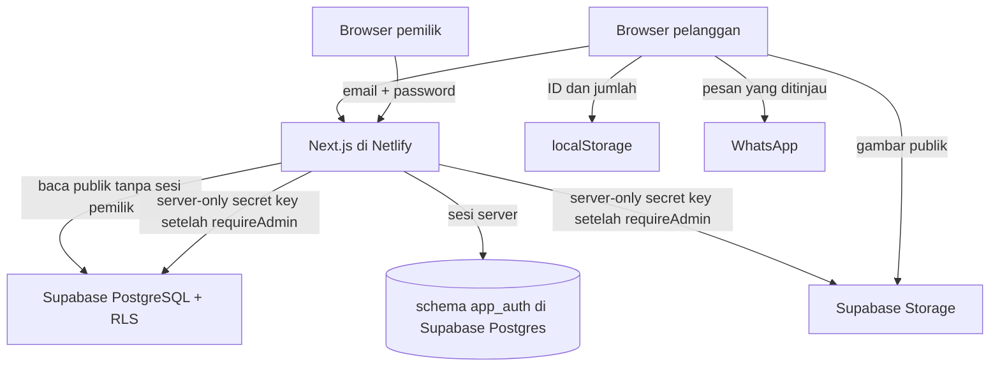

# TRD — Website Mamitika

**Versi:** 1.0 · **Tanggal:** 7 Oktober 2026  
**Dasar produk:** [PRD.md](PRD.md), disetujui pengguna sebagai dasar pada 7 Oktober 2026.  
**Pendamping:** [DESIGN.md](DESIGN.md) menetapkan UI; [TASK.md](TASK.md) menetapkan urutan implementasi.

Dokumen ini menetapkan rancangan untuk implementasi berikutnya. Aplikasi, database, akun layanan, dan deployment belum dibuat. Semua path kode di bawah merupakan path yang akan dibuat, bukan klaim bahwa kode sudah tersedia.

## 1. Keputusan dan ruang lingkup

Pengguna mengizinkan pemilihan stack tanpa batas teknologi, menginginkan layanan gratis sebagai awal, bersedia upgrade bila batas layanan mengganggu operasional, dan pada 8 Oktober 2026 memilih autentikasi lokal email/password seperti Laravel Breeze tanpa Google/OAuth atau integrasi identitas eksternal.

| Komponen | Keputusan |
| --- | --- |
| Aplikasi | Next.js App Router + React + TypeScript strict; public dan admin dalam satu aplikasi. |
| Styling | CSS variables, CSS biasa dan CSS Modules; komponen sesuai DESIGN. |
| Data | Supabase PostgreSQL dan Storage dengan RLS. |
| Login admin | Better Auth email/password dengan sesi database; hanya satu akun owner diprovision operator. Tidak ada Supabase Auth, Google/OAuth, self-signup, atau reset password email. |
| Hosting awal | Netlify Free; domain mamitika.com dipindahkan setelah pratinjau lolos pemeriksaan. |
| Status lokal | React Context + reducer untuk keranjang; localStorage hanya menyimpan ID dan jumlah. |
| Pemesanan | WhatsApp click-to-chat; tidak ada database order atau pembayaran online. |
| Pengelolaan | Satu pemilik; perubahan katalog langsung tersedia setelah penyimpanan berhasil. Pratinjau sebelum menyimpan, bukan sistem revisi/draft terpisah. |
| Pengujian | Node test runner untuk aturan bisnis; pemeriksaan SQL/RLS dan browser untuk akses serta alur nyata. |

Baseline paket hasil pemeriksaan registry npm pada tanggal dokumen: `next@16.4.0`, `react@19.3.0`, `react-dom@19.3.0`, `@supabase/supabase-js@2.117.3`, dan versi stabil Better Auth yang dipilih saat implementasi. Gunakan PostgreSQL adapter Better Auth yang didukung dan `pg`; tidak perlu `@supabase/ssr` untuk login. Gunakan **Node.js 24 LTS** dengan patch LTS terbaru. Pin versi tepat dan lockfile saat implementasi; cek patch keamanan terbaru sebelum instalasi, bukan menyalin versi lama tanpa pemeriksaan. [Registry Next](https://registry.npmjs.org/next/latest), [React](https://registry.npmjs.org/react/latest), [React DOM](https://registry.npmjs.org/react-dom/latest), [Supabase JS](https://registry.npmjs.org/@supabase/supabase-js/latest), [Better Auth PostgreSQL](https://better-auth.com/docs/adapters/postgresql), [status Node LTS](https://nodejs.org/en/about/previous-releases).

Tambahan runtime hanya `sharp` untuk memvalidasi dan menormalisasi foto upload. Tidak memerlukan ORM, Redux, date picker, library animasi, rich text editor, UI kit besar, atau backend kedua. Form menggunakan kontrol HTML asli. Jika scaffold/dependency terpasang sudah menyediakan kebutuhan, gunakan dahulu.

## 2. Arsitektur dan aliran data



Halaman publik dirender di server agar nama, harga, dan deskripsi tersedia di HTML awal. Komponen interaktif terbatas pada filter, menu mobile, lightbox, keranjang, dan formulir. Untuk awal, query katalog dibaca segar per permintaan; gunakan dynamic rendering dan nonaktifkan Cache Components pada scaffold. Hindari cache aplikasi tambahan sampai kebutuhan nyata ditemukan. Next.js Proxy membatasi navigasi `/admin/:path*` dan `/login` sebagai pemeriksaan awal, tetapi seluruh Server Action/Route Handler tetap memanggil `requireAdmin()`. Public reader memakai publishable key dan RLS hanya membaca data publik. Better Auth menyimpan sesi/user/credential dalam schema Postgres privat; satu owner account dibuat melalui provisioning operator dan signup publik dimatikan.

Admin mutations berjalan melalui server-only Supabase client memakai secret key setelah `requireAdmin()` memvalidasi Better Auth session dan `ADMIN_USER_ID`. Secret key melewati RLS; karena itu kontrol otorisasi admin berada di server Next.js dan setiap Server Action/Route Handler harus terlindungi serta diuji terhadap request tanpa sesi. Publishable client publik tetap tunduk pada RLS dan tidak memiliki grant tulis. Jangan pernah menaruh secret key di bundle/browser. Upload memakai Route Handler server-only setelah pemeriksaan sesi. Setelah perubahan berhasil, tampilan admin diperbarui dan halaman publik berikutnya membaca nilai baru. Jangan menampilkan sukses sebelum database mengonfirmasi perubahan.

Netlify mendukung SSR, Server Actions, dan image optimization melalui adapter Next.js yang dideteksi otomatis. Jangan memasang/pin adapter manual atau menambahkan rewrite SPA `/* → /index.html`. Build: `npm run build`; publish: `.next`. [Panduan Next.js Netlify](https://docs.netlify.com/build/frameworks/framework-setup-guides/nextjs/overview/).

## 3. Struktur proyek

Dokumen dan hasil pengumpulan tetap di root. Aplikasi berada di `web/` supaya materi sumber tidak bercampur dengan kode.

```text
PRD.md / TRD.md / DESIGN.md / TASK.md
mamitika-redesign-reference/
  catalog.csv / asset-manifest.csv / images/
web/
  src/app/
    layout.tsx / globals.css / not-found.tsx
    (store)/
      layout.tsx / page.tsx
      menu/page.tsx / menu/[slug]/page.tsx
      snack-box/page.tsx / galeri/page.tsx
      kontak/page.tsx / keranjang/page.tsx
      loading.tsx / error.tsx
    login/page.tsx
    api/auth/[...all]/route.ts
    admin/
      layout.tsx / page.tsx / actions.ts
      produk/page.tsx / produk/baru/page.tsx / produk/[id]/page.tsx
      galeri/page.tsx / pengaturan/page.tsx
    api/catalog/route.ts
    api/admin/images/route.ts
    robots.ts / sitemap.ts
  src/components/
    site-header.tsx / site-footer.tsx / product-card.tsx
    cart-provider.tsx / quantity-input.tsx / gallery-lightbox.tsx
    admin/product-form.tsx / admin/gallery-form.tsx / admin/settings-form.tsx
  src/lib/
    types.ts / catalog.ts / cart.ts / whatsapp.ts / dates.ts / validation.ts
    auth.ts / auth-client.ts / images.ts
    supabase/public.ts / supabase/admin.ts
  scripts/create-owner.mjs / reset-owner-password.mjs
  supabase/migrations/<CLI-generated>_better_auth.sql
  src/proxy.ts
  public/brand/logo.png
  public/images/                  # foto pratinjau, bukan sumber produksi kedua
  data/catalog.seed.json / data/asset-map.json
  supabase/migrations/<CLI-generated>_catalog.sql
  scripts/import-catalog.mjs
  tests/business.test.ts / tests/validation.test.ts / tests/auth.test.ts / tests/authz.sql
  next.config.ts / netlify.toml / package.json / package-lock.json
  .env.example / .env.local
```

File tambahan dibuat hanya bila tanggung jawab memerlukannya. CSS Modules ditempatkan di dekat komponen/halaman yang menggunakannya. `types.ts` mendefinisikan kontrak bersama; file lain langsung melakukan pekerjaannya, tanpa lapisan repository/factory generik. `catalog.seed.json` adalah turunan yang telah ditinjau dari CSV, bukan katalog produksi yang terus dibaca saat runtime.

## 4. Model database

Tabel katalog, galeri, dan settings berada di schema `public` dengan RLS aktif. Tabel Better Auth berada pada schema privat `app_auth`, tidak diekspos di Data API. Waktu audit menggunakan `timestamptz` UTC; tanggal acara/pengambilan menggunakan string tanggal kalender atau tipe `date` yang ditafsirkan sebagai Asia/Jakarta. Harga menggunakan integer rupiah; jangan menggunakan floating point untuk uang.

### 4.1 `products`

| Field | Tipe / aturan |
| --- | --- |
| `id` | UUID primary key; stabil sepanjang masa produk. |
| `slug` | text unique, lowercase kebab-case, max 160; dibuat sekali dan readonly setelah pembuatan. |
| `name` | text, trim, panjang 1–120. |
| `category` | text CHECK: `roti`, `kue_basah`, `risoles_lumpia`. |
| `description` | text plain, max 1.200. |
| `price_rupiah` | integer, wajib >0. |
| `package_label` | text nullable, max 80, misalnya `isi 8 pcs`; tidak menebak isi yang kosong. |
| `quantity_unit` | text nullable, max 40; `kemasan` untuk unit yang sudah diketahui. |
| `availability` | text CHECK: `unconfirmed`, `ready`, `preorder`, `unavailable`; default `unconfirmed`. |
| `preorder_lead_days` | integer nullable, >=0; hanya menampilkan tenggat bila sudah diketahui. |
| `is_active` | boolean; default false untuk produk baru sampai data valid dan pemilik memilih aktif. |
| `is_featured`, `sort_order` | boolean default false, integer default 0. |
| `image_path`, `image_alt` | text; path bucket milik aplikasi; alt deskriptif max 180. Wajib saat aktif. |
| `image_width`, `image_height` | integer >0 dari decoder; bukan input bebas admin. |
| `image_position_x/y` | integer 0–100, default 50. |
| `created_at`, `updated_at` | timestamptz; `updated_at` diperbarui oleh trigger. |

Urutan publik: `sort_order`, `name`, `id`. Frozen dan matang tetap SKU berbeda. Tidak ada tabel stok real time.

Perubahan nama tidak mengubah slug. Pembatasan slug readonly adalah pilihan teknis untuk menjaga URL tanpa membangun pengelolaan redirect dinamis. Jika slug perlu dipindahkan oleh pengembang, perubahan disertai redirect permanen di `next.config.ts`, sesuai PRD; tidak menyediakan pengubahan slug bebas pada admin. Server menolak payload yang mengganti slug produk yang ada; trigger database mencegah perubahan normal melalui API.

### 4.2 `gallery_items`

`id uuid PK`; `image_path text`; `image_alt text` (1–180); `caption text` nullable (max 240); `image_width/image_height integer >0`; `sort_order integer`; `is_active boolean`; `created_at/updated_at timestamptz`. Galeri tidak memiliki harga dan tidak otomatis menjadi produk.

### 4.3 `site_settings`

Satu baris, `id smallint PK CHECK(id=1)`. Field:

- `whatsapp_number`: digit internasional tanpa `+`, awal `6283197665812`; pola 8–15 digit, tidak diawali 0.
- `instagram_url`: URL HTTPS terverifikasi, awal `https://www.instagram.com/kuenyamamitika`.
- `address_text`: awal `The Royal Stavana E9, Derwati, Bandung`.
- `maps_url`: URL HTTPS, dari tautan sumber yang diperiksa saat migrasi.
- `opening_time` dan `closing_time`: time, awal `06:30` dan `17:00`; `timezone` tetap `Asia/Jakarta`.
- `service_days_text`: nullable; jangan menampilkan “setiap hari” bila kosong.
- `delivery_note` dan `pickup_note`: plain text nullable, max 500. Dukungan kedua metode sudah dikonfirmasi; area dan ongkir belum diketahui.
- `gofood_url` dan `shopeefood_url`: HTTPS nullable, tampil hanya bila diisi dan diperiksa pemilik.
- `snack_min_boxes`, `snack_lead_days`: integer nullable, masing-masing >0 dan >=0. Null berarti belum diketahui.
- `snack_description`: text nullable, max 1.200; copy faktual.
- `updated_at`: timestamptz.

Hero awal dan logo menggunakan aset kurasi pada DESIGN. Penggantian identitas/komposisi hero merupakan perubahan desain, bukan kebutuhan editor halaman bebas.

### 4.4 Schema autentikasi `app_auth`

Better Auth mengelola tabel `user`, `session`, `account`, `verification`, dan `rateLimit` di schema PostgreSQL privat `app_auth`. Tabel tersebut tidak diekspos melalui Supabase Data API dan tidak dapat dibaca pengunjung. Password disimpan sebagai hash `scrypt` melalui Better Auth; aplikasi tidak membuat mekanisme hashing sendiri. Sesi disimpan di database, cookie `httpOnly`, `SameSite=Lax`, dan `Secure` di production. Rate limit login menggunakan storage database, bukan memory per-instance.

Hanya ada satu akun owner. Public sign-up dinonaktifkan. Operator membuat user melalui script CLI lokal yang tidak dipasang sebagai HTTP route, lalu mengatur `ADMIN_USER_ID` pada environment server. Setiap request admin harus cocok dengan ID sesi aktif. Password dapat diganti setelah login; tidak ada email reset. Operator memulihkan akun dengan script lokal yang didokumentasikan. Berikan runtime DB role hanya akses yang diperlukan pada schema `app_auth`; gunakan role migrasi terpisah untuk membuat tabel.

## 5. Akses dan autentikasi

| Resource | Pengunjung | Aksi server admin |
| --- | --- | --- |
| `products` | SELECT hanya `is_active=true` melalui publishable key/RLS | SELECT semua; INSERT/UPDATE tervalidasi setelah `requireAdmin()`, memakai server-only secret key. |
| `gallery_items` | SELECT hanya aktif melalui publishable key/RLS | SELECT semua; INSERT/UPDATE setelah `requireAdmin()`. |
| `site_settings` | SELECT baris 1; isinya hanya informasi usaha publik | UPDATE baris 1 setelah `requireAdmin()`; tidak menambah/menghapus baris. |
| Schema `app_auth` | Tidak ada akses melalui Data API | Better Auth mengakses melalui koneksi PostgreSQL server-only dengan role terbatas. |
| Storage `catalog-images` | File aset publik; upload/write melalui Data API ditolak | Upload server-side setelah `requireAdmin()` menggunakan secret key. |

RLS aktif pada setiap tabel/bucket; anonymous/public policy hanya memberi akses baca yang diperlukan dan tidak memberi grant write. Better Auth menggunakan sesi lokal yang tidak dikenali Supabase RLS. Karena itu, operasi admin menggunakan Supabase secret key server-only yang bypasses RLS, setelah pemeriksaan sesi `requireAdmin()` di server Next.js. Ini memindahkan otorisasi mutasi admin ke server aplikasi; setiap Server Action/Route Handler harus memeriksa sesi dan diuji melalui request langsung tanpa sesi. Jangan mengirim secret key ke browser. RLS tetap melindungi akses publishable/anon dari pelanggan, tetapi bukan lapisan kedua untuk operasi server admin. [RLS dan secret key Supabase](https://supabase.com/docs/guides/database/postgres/row-level-security).

Alur login:

1. `/login` mengirim email/password ke endpoint Better Auth same-origin. Tidak ada OAuth provider, public sign-up, atau email reset route.
2. Better Auth memverifikasi hash password, menerapkan rate limit persisten, dan membuat sesi database dengan cookie aman.
3. `requireAdmin()` mengambil sesi dari server dan membandingkan user ID dengan `ADMIN_USER_ID`. Jika cocok, pemilik menuju `/admin/produk`; jika tidak, request ditolak sebelum query data.
4. Setiap Server Action dan upload mengulangi `requireAdmin()`. Admin DB client terpisah memakai `SUPABASE_SECRET_KEY`; jangan pernah mengembalikan client/secret ke browser. Proxy hanya mempercepat redirect; bukan batas keamanan.

Gunakan integrasi Next.js resmi Better Auth, trusted origins yang dibatasi, CSRF/origin protection aktif, login rate limit memakai database storage, dan cookie `httpOnly`, `SameSite=Lax`, `Secure` saat production. Jangan log password/session/cookie. Response admin/login tidak boleh dicache bersama.

Bootstrap: operator menerapkan schema Better Auth ke schema `app_auth` lewat CLI/migration setelah meninjau SQL. Jalankan script CLI lokal untuk membuat satu akun owner; jangan menyediakan route pendaftaran publik. Atur `ADMIN_USER_ID`, `BETTER_AUTH_SECRET`, `BETTER_AUTH_URL`, serta koneksi DB server-only. Pemilik dapat mengganti password dengan autentikasi ulang; password terlupa dipulihkan operator dengan script lokal, tanpa email provider.

## 6. Kontrak aplikasi

### 6.1 Tipe bersama

```ts
type Availability = 'unconfirmed' | 'ready' | 'preorder' | 'unavailable';
type Category = 'roti' | 'kue_basah' | 'risoles_lumpia';
type Fulfillment = 'delivery' | 'pickup' | 'undecided';
type CartItem = { productId: string; quantity: number };
type StoredCart = { version: 1; items: CartItem[] };
type CartRestoreResult = { cart: StoredCart; hadInvalidData: boolean };
type OrderPreferences = {
  fulfillment: Fulfillment;
  area?: string;
  requestedDate?: string; // YYYY-MM-DD, Asia/Jakarta
  note?: string;
};
type SnackInquiry = {
  eventType?: string;
  eventDate: string;
  boxes: number;
  contents?: string;
  budgetPerBox?: number;
  area?: string;
  note?: string;
};
type ActionResult<T> =
  | { ok: true; data: T }
  | { ok: false; message: string; fieldErrors?: Record<string, string> };
```

`PublicProduct` memakai camelCase dari field produk yang diperlukan UI: `id`, `slug`, `name`, `category`, `description`, `priceRupiah`, `packageLabel`, `quantityUnit`, `availability`, `preorderLeadDays`, `isFeatured`, `sortOrder`, `imagePath`, `imageAlt`, `imageWidth`, `imageHeight`, `imagePositionX/Y`, `updatedAt`. Hanya produk aktif masuk respons publik; gambar mendapatkan URL dari bucket, bukan URL bebas yang dapat dikendalikan input.

`SiteSettings` memakai camelCase dari field publik bagian 4.3. Keduanya didefinisikan di `types.ts` sekali, dengan adapter snake_case di `catalog.ts`.

`ProductInput` memakai `name`, `category`, `description`, `priceRupiah`, `packageLabel`, `quantityUnit`, `availability`, `preorderLeadDays`, `isActive`, `isFeatured`, `sortOrder`, `imagePath`, `imageAlt`, `imagePositionX/Y`. Slug baru dibentuk server dari nama dan diberi suffix ID jika diperlukan agar unik; input tidak boleh mengubah slug produk lama. `GalleryInput` memakai `imagePath`, `imageAlt`, `caption`, `sortOrder`, `isActive`; `SettingsInput` memakai field camelCase yang boleh diedit pada §4.3, tidak termasuk id/timezone/updatedAt. Dimension gambar pada database diturunkan oleh server setelah memeriksa objek upload, bukan menerima angka dari client.

### 6.2 Endpoint publik

`GET /api/catalog` → `{ products: PublicProduct[], settings: SiteSettings, fetchedAt: string }`, dengan `Cache-Control: no-store`. Error layanan → HTTP 503 dan pesan umum; tidak berubah menjadi array kosong/sukses. Tidak ada session cookie atau data admin dalam response. Daftar galeri dibaca server di halamannya.

`getPublicCatalog(): Promise<{products: PublicProduct[]; settings: SiteSettings; fetchedAt: string}>` dan `getPublicGallery()` berada di `catalog.ts`, menggunakan client anonim tanpa persistence sesi. `getPublicProduct(slug)` hanya membaca produk aktif. PublicProduct yang unavailable tetap terlihat tetapi tidak dapat ditambahkan. Produk nonaktif/tidak ditemukan memakai halaman “Produk tidak ditemukan atau sudah tidak ditawarkan” dengan tautan menu; tidak membocorkan data nonaktif.

### 6.3 Keranjang dan ringkasan

Fungsi di `cart.ts`:

- `parseStoredCart(raw: string | null): CartRestoreResult`: validasi versi, UUID, quantity bilangan bulat positif dan aman; abaikan entri rusak, gabungkan duplikat, tidak menerima nama/harga dari storage. Raw null memberi keranjang kosong dan `hadInvalidData=false`; JSON/versi/entri tak valid memberi flag true agar UI menampilkan pemberitahuan. Tidak menulis storage sebelum hidrasi selesai.
- `reconcileCart(items: CartItem[], products: PublicProduct[]): CartReview`: menghasilkan `lines`, `blockedItems`, `subtotalRupiah`, `requiresPreorderDate`, dan `minimumRequestedDate` bila tenggat terisi.
- `CartReview.lines`: `{product: PublicProduct, quantity: number, lineTotalRupiah: number}[]`; `blockedItems`: `{productId, reason: 'missing'|'unavailable'}[]`.
- `validateOrderPreferences(input, review, settings, today): ActionResult<OrderPreferences>`: tanggal valid untuk keranjang pre-order; lokasi/catatan trimmed, area max 120 dan catatan max 500; fulfillment dari enum.

Uang memakai integer dan `Number.isSafeInteger` untuk quantity, perkalian, dan total. Nilai yang melampaui batas aman ditolak, bukan dibulatkan. `Intl.NumberFormat('id-ID', {style:'currency', currency:'IDR', maximumFractionDigits:0})` menghasilkan teks rupiah.

Storage key `mamitika.cart.v1` hanya berisi `StoredCart`. Preferensi/catatan berada di memori. Saat restore, beri keterangan “Harga mengikuti menu terbaru.” Harga terkini selalu dibaca lagi sebelum pratinjau final. Bandingkan harga yang terakhir terlihat pada sesi dengan snapshot baru, tampilkan perubahannya, lalu minta pengguna meninjau ringkasan. Setelah refresh tidak perlu menyimpan harga lama untuk menampilkan klaim perubahan historis.

Missing/unavailable tetap dipertahankan dalam keranjang untuk dijelaskan; tidak ikut subtotal atau pesan. Tombol lanjut diblokir sampai pengguna menghapus item tersebut. Kegagalan fetch mempertahankan keranjang dan memberi Coba lagi. Hubungi Mamitika tetap tersedia sebagai kontak umum tanpa subtotal lama yang dianggap valid. Tidak menghapus keranjang ketika WhatsApp dibuka.

### 6.4 WhatsApp dan tanggal

`whatsapp.ts`: `buildOrderMessage(review, preferences): string`; `buildSnackMessage(inquiry): string`; `buildWhatsAppUrl(number, message): string | null`. Pesan mengikuti contoh PRD dan menambahkan metode, lokasi ringkas, tanggal, dan catatan jika ada. `new URL()` / `URLSearchParams` melakukan encoding tepat sekali. Nomor dari settings, validasi 8–15 digit. Subtotal bukan total akhir.

Jika URL terenkode melewati **8.000 karakter**, kembalikan null dan UI menawarkan Salin ringkasan serta Buka chat tanpa pesan. Batas ini adalah pilihan konservatif aplikasi untuk kompatibilitas, bukan klaim batas resmi WhatsApp. Jangan memotong isi pesanan. Clipboard gagal → tampilkan teks lengkap yang dapat dipilih/disalin manual.

`dates.ts`: `todayInJakarta(now?: Date): string` dan `isValidCalendarDate(value: string): boolean`. Gunakan `Intl.DateTimeFormat` dengan `timeZone:'Asia/Jakarta'` dan `formatToParts` untuk membangun YYYY-MM-DD; bukan tanggal UTC dari `toISOString().slice(0,10)`. Tolak tanggal mustahil dan lampau. Tenggat null tidak diberi nilai bisnis palsu; jadwal selalu perlu konfirmasi.

`validateSnackInquiry(input, settings, today): ActionResult<SnackInquiry>` di `validation.ts`: tanggal dan box wajib, box bilangan bulat positif aman, anggaran opsional integer rupiah >0, panjang jenis acara 120, isi 500, lokasi 120, catatan 500. Minimum/tenggat hanya berlaku jika settings terisi. Form tidak menyimpan data pelanggan ke database.

### 6.5 Mutasi admin

`auth.ts`: `requireAdmin(): Promise<{userId:string}>`, ambil sesi melalui Better Auth server API lalu cocokkan `session.user.id` dengan `ADMIN_USER_ID`; lempar error akses bila sesi atau ID tidak cocok.

`admin/actions.ts`: `saveProduct(id: string | null, input: ProductInput): Promise<ActionResult<{id:string}>>`; `saveGalleryItem(id: string | null, input: GalleryInput)`; `saveSettings(input: SettingsInput)`. Input merujuk batas field bagian 4 dan divalidasi di `validation.ts`. Setiap mutation memanggil `requireAdmin()` lalu memakai server-only Supabase admin client; menyebut field yang boleh diubah dan tidak melakukan mass assignment. Produk baru valid, kemudian aktif bila checkbox dipilih. Penonaktifan memakai fungsi save yang sama; tidak butuh endpoint terpisah.

`POST /api/admin/images` menerima multipart field `file` setelah pemeriksaan sesi pemilik dan Origin yang sama dengan aplikasi; response `{path,width,height}` atau status 400/401/403/413/503. Error tidak berisi token atau detail internal layanan. Input autentikasi/mutasi tidak boleh dilog lengkap.

## 7. Foto, upload, dan migrasi

Bucket publik `catalog-images` hanya untuk foto usaha. Upload server memeriksa maksimum **3 MiB**, decode JPEG/PNG/WebP sungguhan, maksimum 20 megapiksel, orientasi, lalu menghasilkan WebP dengan sisi maksimum 1.600 px tanpa memperbesar sumber. `sharp` dideklarasikan langsung dalam dependencies jika diimport. Metadata dibuang; nama object baru `{uuid}.webp`, bukan nama berkas pengguna. Foto sebelumnya tetap menjadi referensi produk sampai save database berhasil.

`images.ts` menyediakan `normalizeImage(input: Uint8Array): Promise<{bytes:Uint8Array; width:number; height:number}>`, dipakai importer dan upload handler. Modul ini tidak diimport komponen client. `getStoredImageInfo(path: string)` membaca ulang objek bucket dan memeriksa dimensi/kebenaran format saat penyimpanan produk/galeri; path divalidasi sebagai UUID WebP, tidak mengambil URL arbitrary.

Storage tidak di-upsert pada path lama. Upload berhasil tetapi save gagal meninggalkan kandidat yang bisa digunakan saat retry; tidak merusak foto lama. Cleanup objek yang benar-benar tidak direferensikan dilakukan manual sesudah pemeriksaan/backup, tanpa cron pada versi pertama. Public write ditolak oleh Storage RLS; upload dilakukan Route Handler server setelah `requireAdmin()` dengan server-only secret key, yang melewati RLS. File publik memang dapat dibaca melalui URL. [Akses Storage](https://supabase.com/docs/guides/storage/security/access-control).

`next/image` memakai ukuran/sizes DESIGN, dimensi dari decoder, dan remotePatterns hanya host Supabase project yang benar dengan path bucket `catalog-images`. URL `lh7-us.googleusercontent.com` hasil ekstraksi tidak menjadi sumber runtime produksi. Logo lokal `public/brand/logo.png` memakai salinan logo asli.

Migrasi:

1. Baca 18 produk CSV; buat `catalog.seed.json` dan `asset-map.json` setelah mencocokkan konteks beranda dan gambar. Field mapping: `productSlug`, `sourceFile`, `alt`, `verified`, `notes`.
2. Nama file/alt lama adalah petunjuk, bukan bukti SKU. Foto berlabel smoked beef pada galeri, misalnya, secara visual memuat bentuk roti bertabur; pemilik/konteks kartu perlu memastikan mapping.
3. Produk belum terverifikasi tetap nonaktif pada produksi; preview boleh menampilkan placeholder dengan label internal “foto perlu dipetakan”. Jangan menyajikan placeholder tersebut sebagai foto asli produk.
4. Dedup 38 berkas berdasarkan hash; galeri dikurasi. Jangan membuat SKU untuk Lemper/Blueberry/Bolu Pisang tanpa data jual.
5. Impor lewat script sekali jalan dan SDK yang sudah dipakai. Secret key hanya dalam environment proses importer lokal dan server Netlify; tidak pernah dibundel ke browser atau dicetak. Script mempunyai dry-run dan melewati slug yang sudah ada agar pengulangan tidak menimpa perubahan pemilik. Upload/import gagal dicatat per item tanpa kredensial.

## 8. Environment dan konfigurasi

| Variabel | Pemakaian |
| --- | --- |
| `NEXT_PUBLIC_SUPABASE_URL` | URL project, tersedia browser/server. |
| `NEXT_PUBLIC_SUPABASE_PUBLISHABLE_KEY` | Publishable key; kontrol akses tetap melalui RLS. |
| `BETTER_AUTH_SECRET` | Secret acak kuat untuk sesi/kripto Better Auth; server-only. |
| `BETTER_AUTH_URL` | Origin canonical API auth, server-only. |
| `DATABASE_URL` | Koneksi PostgreSQL pooler dan role runtime terbatas untuk schema `app_auth`; server-only. |
| `ADMIN_USER_ID` | ID akun owner yang diprovision operator; server-only, tidak bisa diubah dari UI. |
| `SITE_URL` | Server, origin deployment canonical untuk callback dan validasi upload; localhost saat lokal. |
| `NEXT_PUBLIC_SITE_URL` | Origin publik untuk tautan/metadata bila diperlukan di browser. |
| `SUPABASE_SECRET_KEY` | Secret Supabase server-only untuk mutation admin dan importer; bypasses RLS. Tidak pernah dikirim ke browser/log. |

Tidak ada client ID/secret pihak ketiga atau provider OAuth. Better Auth menggunakan password hashing dan session cookies; Supabase service secret hanya dipakai pada server sesudah session diverifikasi. Karena secret bypasses RLS, admin endpoints harus minimal dan seluruhnya memanggil `requireAdmin()`. Public clients tetap menggunakan publishable key dengan RLS. [Better Auth email/password](https://better-auth.com/docs/authentication/email-password), [jenis key Supabase dan RLS](https://supabase.com/docs/guides/database/postgres/row-level-security).

Commit `.env.example` dengan nilai placeholder. Abaikan `.env.local`, `.env.*` berisi secret, serta backup lokal; tetap izinkan `.env.example`. Netlify memerlukan environment server pada scope Builds dan Functions yang relevan; perubahan environment membutuhkan redeploy. Preview tidak boleh menulis ke database produksi. Gunakan dua project Free bila slot tersedia: development/preview dan production. Jika hanya satu slot tersedia, hentikan konfigurasi preview yang dapat menulis produksi sampai isolasi dipilih; jangan menganggap preview sebagai sandbox aman.

## 9. SEO, biaya, backup, dan deployment

Metadata title/description per halaman, sitemap hanya produk aktif, `lang=id`, canonical domain final, redirect permanen `/home` → `/` dan `/gallery` → `/galeri`. Admin/login tidak diindeks dan tidak masuk sitemap; robots bukan pengganti login. Structured data menggunakan nama/harga/alamat terverifikasi, tidak mengarang rating, stok, sertifikasi, atau hari buka.

Target performa dan aksesibilitas mengikuti PRD §§7/9. Render tanpa cache awal adalah kompromi sederhana; jika traffic nyata menekan kuota atau waktu server, tambahkan cache publik dengan invalidasi setelah perubahan admin dan pertahankan fresh review keranjang. Jangan memakai request periodik untuk mencegah layanan Free pause.

**Batas Free yang diperiksa pada 7 Oktober 2026:** Netlify Free menyediakan 300 kredit/bulan dan berhenti melayani saat kuota terlampaui sampai pemulihan/upgrading; Supabase Free mempunyai 500 MB database dan 1 GB Storage serta dapat pause setelah satu minggu tidak aktif. Better Auth adalah library yang berjalan di aplikasi; database, koneksi, dan storage sesi menggunakan kuota Supabase. Harga/kuota berubah; cek dashboard sebelum rilis dan saat pemakaian mendekati batas. Kuota bukan estimasi jumlah pelanggan yang bisa ditangani Mamitika. [Netlify pricing](https://www.netlify.com/pricing/), [Supabase pricing](https://supabase.com/pricing/), [Better Auth PostgreSQL](https://better-auth.com/docs/adapters/postgresql).

Backup sebelum impor produksi dan perubahan besar: dump database melalui fasilitas Supabase/CLI serta salin objek Storage yang digunakan. Dump database tidak menyertakan byte gambar. Simpan backup lokal yang terlindungi, bukan repo publik. Uji restore satu backup pada project development: jumlah SKU, settings, dan foto harus cocok. Jangan menganggap paket Free menyediakan pemulihan otomatis yang sudah memenuhi kebutuhan ini.

Deployment: preview dengan data development → browser/security checks → pemilik meninjau → backup produksi → deploy aplikasi, koneksi auth database, dan secrets production → smoke check preview → ubah DNS domain → periksa HTTPS dan cookie session. Periksa record DNS yang sudah ada dan pertahankan record email. Pembelian paket, perubahan DNS, dan publikasi dilakukan setelah hasil konkret dapat ditinjau pemilik. Rollback deployment mengembalikan kode; perubahan database memerlukan migrasi kompatibel/restore terpisah.

## 10. Pemeriksaan dan keputusan terbuka

Unit checks mencakup hitung Rp102.000; restore rusak; perubahan harga; missing/unavailable; overflow; encoding `&`, baris baru dan emoji; fallback URL panjang; tanggal batas hari WIB; date mustahil; minimum snack box null/terisi; Better Auth sign-in, signup ditolak, sesi valid/kedaluwarsa, dan password change. SQL checks memastikan grant/RLS anonymous menolak write; jangan mengklaim SQL mengenali owner Better Auth karena sesi lokal diverifikasi oleh server aplikasi dan secret key bypasses RLS.

Browser checks mencakup persist keranjang, save admin → refresh publik, login owner dengan kredensial lokal, signup ditolak, akses admin tanpa sesi ditolak untuk setiap action/route, kegagalan upload, logout/session expiry, responsive viewport, keyboard/lightbox, dan pratinjau WhatsApp tanpa mengirim pesan. Dokumentasikan browser/perangkat yang belum diuji. Test build, lint, dan typecheck adalah pemeriksaan berbeda.

Masih perlu diisi oleh pemilik/operator saat implementasi: email owner, provisioning awal/reset lokal, `BETTER_AUTH_SECRET`, `DATABASE_URL` role terbatas, `ADMIN_USER_ID`, Supabase server secret, akses akun domain, URL GoFood/ShopeeFood, cakupan/ongkir pengiriman, hari layanan, minimum/tenggat snack box, status per SKU, serta approval mapping dan harga. Jangan meminta password pemilik lewat chat atau menulisnya di dokumen. Detail bisnis kosong tetap null dan memakai alur konsultasi. Environment/database diperlukan sebelum integrasi live.
